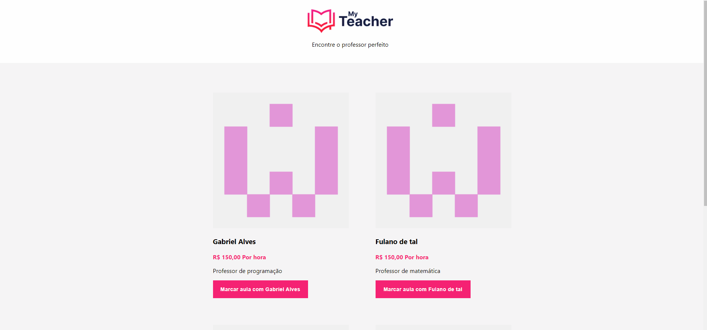

<p align="center">
  
</p>

<hr>
# Sobre o projeto


<p>A aplicação desenvolvida tem por finalidade ajudar alunos que estejam procurando auxílio para aprender determinada matéria escolar e/ou universitária a encontrarem professores que oferecam mentoria 
no asunto desejado. MyTeacher é um projeto fictício realizado durante o workshop Treinaweb Multi Stack, que tem por objetivo o aprendizado de novas tecnologias e conceitos de arquiteturas para a criação 
de aplicações de médio e grande porte.</p>


      

<p></p>

## Pré-requisitos

Antes de comecar, você vai precisar ter instalado em sua máquina as seguintes ferramentas: [Git](https://git-scm.com), [Docker](https://www.docker.com/). E também bom ter um editor de texto para para trabalhar com o código fonte como [VSCode](https://code.visualstudio.com/) por exemplo.


# Como executar


```bash
#Baixar o repositório do projeto
git clone git@bitbucket.org:gabrielalves962008/my-teacher.git

#acessando a pasta com a aplicação 
cd my-teacher

#inicializando o projeto no docker
docker-compose up

```
